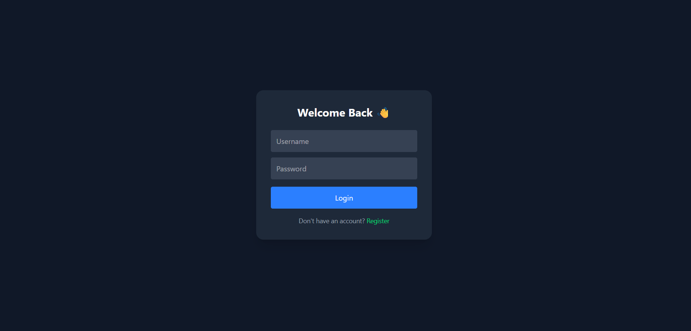
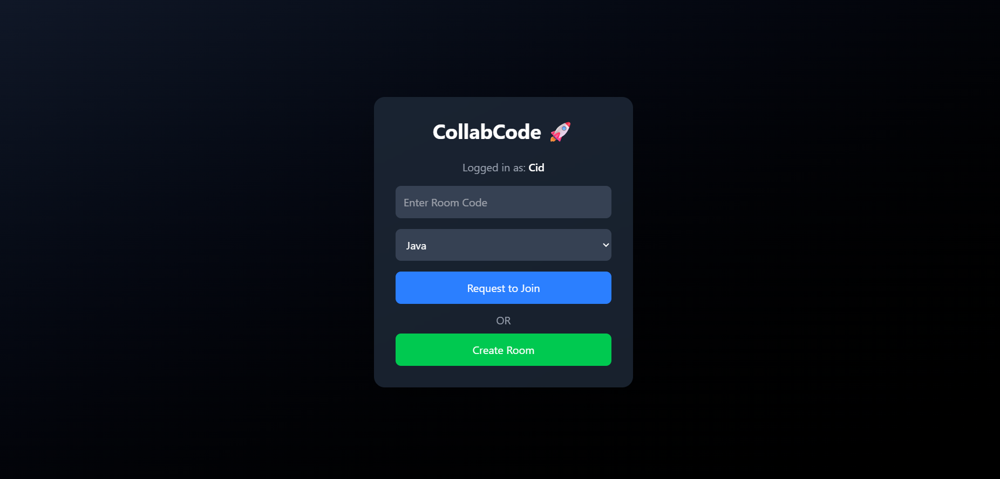
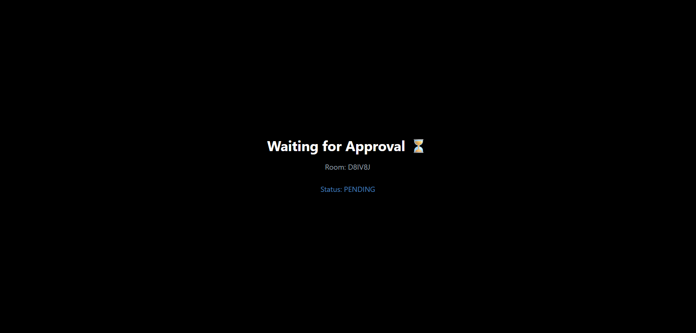
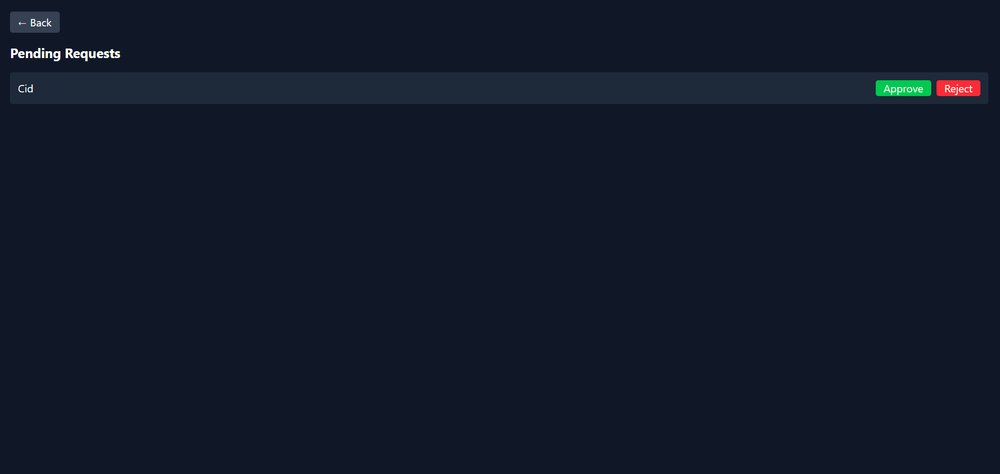
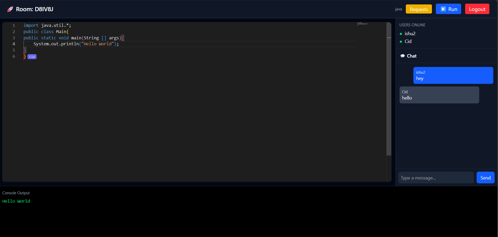

# CollabCode 🚀

A real-time collaborative coding platform with live code sync, cursor tracking, chat, and host-based access control — built for seamless coding interviews and teamwork.

## ✨ Features

- 🔐 JWT Authentication & Authorization
- 👥 Host-based Room Approval System
- ⏳ Waiting Room for Pending Users
- 💻 Real-time Code Collaboration
- 🖱️ Live Cursor Tracking
- 💬 Integrated Chat System
- ⚡ Multi-language Execution (Java, C++, Python, JavaScript)
- 👨‍💻 Active Users Tracking

## 🛠️ Tech Stack

Frontend:
- React
- Tailwind / CSS

Backend:
- Node.js
- Express

Real-time:
- WebSocket
- SockJS

Authentication:
- JWT

Code Execution:
- Judge0 API

## 📸 Screenshots

### 🔐 Login Page

### 🏠 Home Page

### ⏳ Waiting Room

### ✅ Approval Panel

### 💻 Collaborative Editor

## ⚙️ Installation

### 1. Clone the repository
git clone https://github.com/your-username/collabcode.git

### 2. Backend setup
cd backend
npm install
npm start

### 3. Frontend setup
cd frontend
npm install
npm run dev

## 🔑 Environment Variables

Create a `.env` file in backend:

PORT=8080
JWT_SECRET=your_secret_key
JUDGE0_API_KEY=your_key

## 🚀 Future Improvements

- Code persistence (save sessions)
- Role-based permissions
- Video/audio integration
- Version history

## 👨‍💻 Author

- Ishu Rajora
- GitHub: https://github.com/Ishu-47

